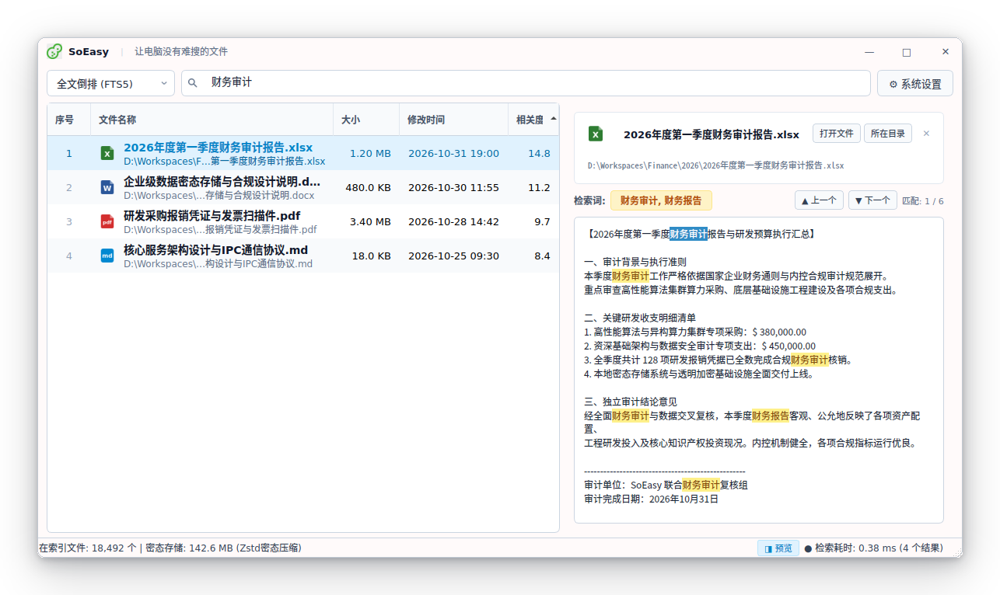
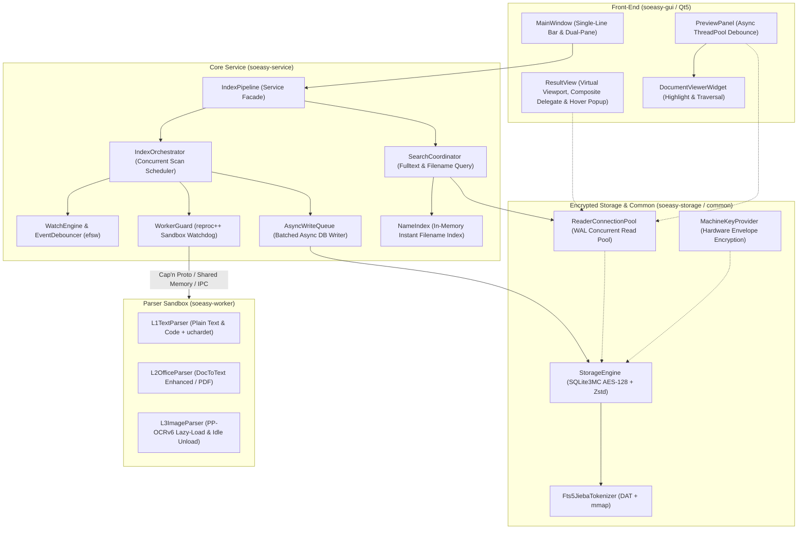

# SoEasy

> **Make Every File Searchable On Your Desktop**  
> *让电脑没有难搜的文件*

[English](README.md) | [简体中文](README_zh.md) | [Latest Release](https://github.com/lilucpp/soeasy/releases/latest)

---

SoEasy is a native, privacy-first, ultra-fast desktop search engine. Built with modern C++17 and Qt5, it indexes and searches source code repositories, Office suites, spreadsheets, presentations, PDFs, and scanned documents entirely offline with sub-millisecond query response and instant content preview.

Zero Electron bloat, zero cloud telemetry, and complete crash resilience through multi-process sandbox isolation.

<p align="center">
  
</p>

---

## Highlights

- **Instant Full-Text & Filename Search**: Powered by SQLite FTS5 with Double-Array Trie Jieba tokenization and BM25 ranking. Features live debounced in-document keyword preview.
- **Crash-Resilient Sandbox Isolation**: All document parsing runs within an isolated subprocess (`soeasy-worker`) governed by modern `reproc++`. Malformed or looping files are killed and self-healed in milliseconds without freezing the UI.
- **Double-Array Trie (DAT) + mmap Tokenization**: Precompiles 350,000 dictionary words into contiguous DAT binary blocks, mapped via kernel `mmap`. Memory footprint plunges from **120 MB down to 7.2 MB** (94% RAM reduction).
- **Lightweight Deep Learning OCR**: Bundles PP-OCRv6 with zero-allocation Header Probe nanosecond sniffing ($< 1\,\mu\text{s}$) to filter micro-icons and borders before decoding. Cuts RAM by 34% and accelerates inference by >40%.
- **Hardware-Bound Local Encryption**: Zero cloud dependence. Index databases are protected with page-level AES-128 encryption (SQLite3MultipleCiphers) and Zstandard Level 3 compression, bound to host hardware to prevent offline theft.
- **Modern Component Architecture**: Features composite filename and path presentation, a clean single-line search bar, full keyboard navigation (<kbd>Enter</kbd>, <kbd>Ctrl+O</kbd>, <kbd>Ctrl+P</kbd>, <kbd>F3</kbd>), and real-time incremental filesystem watching.

> 💡 **Deep Architectural Specifications**: For in-depth implementation details on process supervision, DAT Trie derivation, nanosecond Header Probe heuristics, and machine-bound envelope encryption, see 📖 **[Deep Architectural Principles (docs/features.md)](docs/features.md)**.

---

## Architecture Overview


```mermaid
flowchart TD
    subgraph UI ["Front-End (soeasy-gui / Qt5)"]
        MainWindow["MainWindow (Single-Line Bar & Dual-Pane)"]
        ResultView["ResultView (Virtual Viewport, Composite Delegate & Hover Popup)"]
        PreviewPanel["PreviewPanel (Async ThreadPool Debounce)"]
        DocViewer["DocumentViewerWidget (Highlight & Traversal)"]
    end

    subgraph Core ["Core Service (soeasy-service)"]
        IndexPipeline["IndexPipeline (Service Facade)"]
        Orchestrator["IndexOrchestrator (Concurrent Scan Scheduler)"]
        SearchCoord["SearchCoordinator (Fulltext & Filename Query)"]
        NameIndex["NameIndex (In-Memory Instant Filename Index)"]
        WriteQueue["AsyncWriteQueue (Batched Async DB Writer)"]
        WatchEngine["WatchEngine & EventDebouncer (efsw)"]
        WorkerGuard["WorkerGuard (reproc++ Sandbox Watchdog)"]
    end

    subgraph Sandbox ["Parser Sandbox (soeasy-worker)"]
        L1["L1TextParser (Plain Text & Code + uchardet)"]
        L2["L2OfficeParser (DocToText Enhanced / PDF)"]
        L3["L3ImageParser (PP-OCRv6 Lazy-Load & Idle Unload)"]
    end

    subgraph Storage ["Encrypted Storage & Common (soeasy-storage / common)"]
        StorageEngine["StorageEngine (SQLite3MC AES-128 + Zstd)"]
        ReaderPool["ReaderConnectionPool (WAL Concurrent Read Pool)"]
        FTS5["Fts5JiebaTokenizer (DAT + mmap)"]
        MachineKey["MachineKeyProvider (Hardware Envelope Encryption)"]
    end

    MainWindow --> IndexPipeline
    PreviewPanel --> DocViewer
    IndexPipeline --> Orchestrator
    IndexPipeline --> SearchCoord
    Orchestrator --> WatchEngine
    Orchestrator --> WorkerGuard
    Orchestrator --> WriteQueue
    SearchCoord --> NameIndex
    SearchCoord --> ReaderPool
    WorkerGuard -- "Cap'n Proto / Shared Memory / IPC" --> Sandbox
    MachineKey -.-> StorageEngine
    WriteQueue --> StorageEngine
    StorageEngine --> FTS5
    ReaderPool -.-> StorageEngine
    ResultView -.-> ReaderPool
    PreviewPanel -.-> ReaderPool
```

---

## Supported Formats

| Category | File Extensions | Extraction Engine |
| :--- | :--- | :--- |
| **Plain Text & Source Code** | `.txt`, `.md`, `.log`, `.csv`, `.json`, `.xml`, `.html`, `.c`, `.cpp`, `.py`, `.go`, `.rs`, `.java`, `.ts`, `.sh`, etc. | L1 Native parser + uchardet auto-sniffing |
| **Microsoft Office (OOXML)** | `.docx`, `.xlsx`, `.pptx` | L2 DocToText / Fast stream extraction |
| **Microsoft Office Binary** | `.doc`, `.xls`, `.ppt`, `.xlsb` | L2 DocToText binary extractors |
| **WPS Office Suite** | `.wps`, `.et`, `.dps` | L2 DocToText |
| **OpenDocument (ODF)** | `.odt`, `.ods`, `.odp`, `.odg`, `.fodt`, `.fods`, `.fodp` | L2 DocToText |
| **Portable Documents** | `.pdf` (text layer + automatic scan queueing) | L2 Poppler natural flow + OCR fallback |
| **Apple iWork** | `.pages`, `.numbers`, `.key`, `.keynote` | L2 DocToText |
| **Rich Text & Emails** | `.rtf`, `.eml` | L2 DocToText |
| **Images & Vector Graphics** | `.png`, `.jpg`, `.jpeg`, `.webp`, `.bmp`, `.tiff`, `.tif`, `.jfif`, `.pnm`, `.svg` | L3 PP-OCRv6 deep learning OCR + SVG Parser |

> 📌 **Roadmap**: Recursive extraction and streaming search for compressed archives (`.zip`, `.tar`, `.gz`, `.7z`, `.rar`, `.bz2`, `.xz`) are planned for future releases (currently greyed out in settings).

---

## Building from Source

### Prerequisites
- **Clone**: Use `git clone --recursive` to initialize all submodules
- **Compiler**: GCC 8+ or Clang 9+ supporting C++17 (MSYS2 MinGW-w64 recommended on Windows)
- **CMake**: 3.16 or higher
- **Dependencies**: Qt5 (`Widgets`, `Gui`, `Core`), Cap'n Proto, uchardet, zlib, libxml2, libiconv, OpenCV, Boost

### Linux Quick Start

```bash
# Generate Release configuration
cmake -B build -DCMAKE_BUILD_TYPE=Release

# Build in parallel
cmake --build build -j$(nproc)

# Run full test suite
ctest --test-dir build --output-on-failure

# Launch SoEasy
./build/soeasy-gui
```

### Windows Build (MSYS2 MinGW-w64)

> 💡 Aligned with official GitHub Actions CI: MSYS2 MINGW64 environment is recommended:

```bash
# 1. Open MSYS2 MINGW64 terminal and install toolchain & dependencies
pacman -S --noconfirm \
  git base-devel \
  mingw-w64-x86_64-toolchain \
  mingw-w64-x86_64-cmake \
  mingw-w64-x86_64-ninja \
  mingw-w64-x86_64-qt5-base \
  mingw-w64-x86_64-capnproto \
  mingw-w64-x86_64-opencv \
  mingw-w64-x86_64-libxml2 \
  mingw-w64-x86_64-libiconv \
  mingw-w64-x86_64-zlib \
  mingw-w64-x86_64-uchardet \
  mingw-w64-x86_64-boost

# 2. Configure and build with Ninja
cmake -B build -G "Ninja" -DCMAKE_BUILD_TYPE=Release
cmake --build build -j$(nproc)

# 3. Run full automated tests
ctest --test-dir build --output-on-failure

# 4. Launch executable
./build/soeasy-gui.exe
```

---

## License

SoEasy is distributed under the [Apache-2.0 License](LICENSE).
