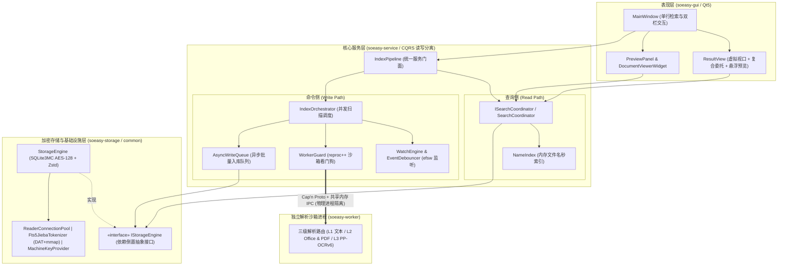

# SoEasy (搜易)

> **让电脑没有难搜的文件**  
> *Make every file searchable on your computer.*

[English](README.md) | [简体中文](README_zh.md) | [最新版本 (Latest Release)](https://github.com/lilucpp/soeasy/releases/latest)

---

SoEasy 是一款追求极速、安全与稳定的原生跨平台桌面全文检索工具。基于现代 C++17 与 Qt5 构建，完全在本地对代码工程、办公文档、电子表格、演示文稿、PDF 与图片扫描件进行离线索引与毫秒级即搜即览。

无 Electron 容器捆绑，无云端数据上传，通过物理多进程隔离沙箱保障常驻运行的极致轻量与坚固稳定。

<p align="center">
  
</p>

---

## 核心亮点速览

- **毫秒级即搜即览**：底层集成 SQLite FTS5 倒排索引引擎与结巴分词，引入 BM25 算法优化相关度排序，支持海量文档中键入即搜与实时高亮正文预览。
- **物理沙箱与崩溃自愈**：文件解析全部置于独立子进程 (`soeasy-worker`) 沙箱内运行，由主进程守卫 (`WorkerGuard`) 通过共享内存统一调度；遭遇死循环或损坏文件时毫秒级强杀自愈，界面永不卡死。
- **双数组 Trie (DAT) + mmap 零堆开销分词**：结巴 35 万词词典预编译为 DAT 二进制文件，运行时直接 `mmap` 零拷贝映射入内核内存页，词典常驻内存从 **120 MB 直降至 7.2 MB**（降低 94%）。
- **极速轻量 OCR 优化引擎**：内置 PP-OCRv6 深度学习引擎，引入独创 Header Probe 纳秒级嗅探提前过滤微型图标与单色块，结合双档位自适应限边检测，显存立降 34%，推理提速超 40%。
- **纯本地硬件绑定透明密态存储**：零网络依赖，拒绝遥测。索引库采用 SQLite3MultipleCiphers 进行页级 AES-128 强加密与 Zstd 高效压缩落盘，通过“一机一密”硬件信封加密技术防止脱机拷贝窃密。
- **现代化组件架构与极简交互**：文件名与路径智能复合呈现，单行搜索栏自由切换“全文倒排”与“文件名秒搜”，支持键盘优先全链路导航与毫秒级文件变动增量监听。

> 💡 **深入技术规格**：关于多进程沙箱治理机制、DAT+mmap 算法推导、Header Probe 纳秒过滤及一机一密加密体系的详尽设计，请参阅 📖 **[核心设计机制与底层架构规格说明 (docs/features_zh.md)](docs/features_zh.md)**。

---

## 系统架构


```mermaid
flowchart TD
    subgraph UI ["表现层 (soeasy-gui / Qt5)"]
        MainWindow["MainWindow (单行检索与双栏交互)"]
        ResultView["ResultView (虚拟视口 + 复合委托 + 悬浮预览)"]
        PreviewPanel["PreviewPanel & DocumentViewerWidget"]
        MainWindow --> ResultView
        MainWindow --> PreviewPanel
    end

    subgraph Core ["核心服务层 (soeasy-service / CQRS 读写分离)"]
        IndexPipeline["IndexPipeline (统一服务门面)"]

        subgraph QuerySide ["查询侧 (Read Path)"]
            SearchCoord["ISearchCoordinator / SearchCoordinator"]
            NameIndex["NameIndex (内存文件名秒索引)"]
            SearchCoord --> NameIndex
        end

        subgraph CommandSide ["命令侧 (Write Path)"]
            Orchestrator["IndexOrchestrator (并发扫描调度)"]
            WatchEngine["WatchEngine & EventDebouncer (efsw 监听)"]
            WorkerGuard["WorkerGuard (reproc++ 沙箱看门狗)"]
            WriteQueue["AsyncWriteQueue (异步批量入库队列)"]
            Orchestrator --> WatchEngine
            Orchestrator --> WorkerGuard
            Orchestrator --> WriteQueue
        end

        IndexPipeline --> SearchCoord
        IndexPipeline --> Orchestrator
    end

    subgraph Sandbox ["独立解析沙箱进程 (soeasy-worker)"]
        ParserRouter["三级解析路由 (L1 文本 / L2 Office & PDF / L3 PP-OCRv6)"]
    end

    subgraph Storage ["加密存储与基础设施层 (soeasy-storage / common)"]
        IStorage["«interface» IStorageEngine (依赖倒置抽象接口)"]
        StorageEngine["StorageEngine (SQLite3MC AES-128 + Zstd)"]
        Subsystems["ReaderConnectionPool | Fts5JiebaTokenizer (DAT+mmap) | MachineKeyProvider"]
        StorageEngine -.->|"实现"| IStorage
        StorageEngine --> Subsystems
    end

    MainWindow --> IndexPipeline
    ResultView --> SearchCoord
    PreviewPanel --> SearchCoord
    SearchCoord --> IStorage
    WriteQueue --> IStorage
    WorkerGuard ==>|"Cap'n Proto + 共享内存 IPC (物理进程隔离)"| ParserRouter
```

---

## 支持格式矩阵

| 格式分类 | 支持扩展名 | 文本抽取内核 |
| :--- | :--- | :--- |
| **纯文本与源代码** | `.txt`, `.md`, `.log`, `.csv`, `.json`, `.xml`, `.html`, `.c`, `.cpp`, `.py`, `.go`, `.rs`, `.java`, `.ts`, `.sh` 等 | L1 原生解析器 + uchardet 编码嗅探 |
| **Microsoft Office (OOXML)** | `.docx`, `.xlsx`, `.pptx` | L2 DocToText / 快速流解压抽取 |
| **Microsoft Office 经典二进制** | `.doc`, `.xls`, `.ppt`, `.xlsb` | L2 DocToText 专有提取器 |
| **金山 WPS 办公套件** | `.wps`, `.et`, `.dps` | L2 DocToText |
| **开放文档格式 (ODF)** | `.odt`, `.ods`, `.odp`, `.odg`, `.fodt`, `.fods`, `.fodp` | L2 DocToText |
| **便携式版式文档** | `.pdf` (原生文本层 + 纯图片扫描件排队) | L2 Poppler 自然排版提取 + 转入 OCR |
| **苹果办公套件 (Apple iWork)** | `.pages`, `.numbers`, `.key`, `.keynote` | L2 DocToText |
| **富文本与电子邮件** | `.rtf`, `.eml` | L2 DocToText |
| **独立图像与矢量图** | `.png`, `.jpg`, `.jpeg`, `.webp`, `.bmp`, `.tiff`, `.tif`, `.jfif`, `.pnm`, `.svg` | L3 PP-OCRv6 深度学习 OCR + SVG 原生解析 |

> 📌 **路线图规划**：压缩归档文件（`.zip`, `.tar`, `.gz`, `.7z`, `.rar`, `.bz2`, `.xz`）递归解包与流式检索功能排期演进中（当前设置界面中呈置灰禁用状态）。

---

## 编译与快速开始

### 依赖环境
- **源码克隆**：请使用 `git clone --recursive` 拉取完整子模块
- **编译器**：支持 C++17 的 GCC 8+ 或 Clang 9+（Windows 推荐 MSYS2 MinGW-w64 环境）
- **CMake**：3.16 及以上版本
- **核心依赖**：Qt5 (`Widgets`, `Gui`, `Core`)、Cap'n Proto、uchardet、zlib、libxml2、libiconv、OpenCV、Boost

### Linux 构建与运行

```bash
# 生成 Release 构建配置
cmake -B build -DCMAKE_BUILD_TYPE=Release

# 并行编译
cmake --build build -j$(nproc)

# 运行全量单元测试与组件自测
ctest --test-dir build --output-on-failure

# 启动 SoEasy
./build/soeasy-gui
```

### Windows 构建 (MSYS2 MinGW-w64)

> 💡 与官方 GitHub Actions CI 构建流程保持严格一致，推荐使用 MSYS2 MINGW64 环境：

```bash
# 1. 打开 MSYS2 MINGW64 终端，安装核心编译工具链与依赖库
pacman -S --noconfirm \
  git base-devel \
  mingw-w64-x86_64-toolchain \
  mingw-w64-x86_64-cmake \
  mingw-w64-x86_64-ninja \
  mingw-w64-x86_64-qt5-base \
  mingw-w64-x86_64-capnproto \
  mingw-w64-x86_64-opencv \
  mingw-w64-x86_64-libxml2 \
  mingw-w64-x86_64-libiconv \
  mingw-w64-x86_64-zlib \
  mingw-w64-x86_64-uchardet \
  mingw-w64-x86_64-boost

# 2. 生成 Ninja 构建配置并编译
cmake -B build -G "Ninja" -DCMAKE_BUILD_TYPE=Release
cmake --build build -j$(nproc)

# 3. 运行全量自动化测试
ctest --test-dir build --output-on-failure

# 4. 运行可执行程序
./build/soeasy-gui.exe
```

---

## 开源许可

本项目遵循 [Apache-2.0 License](LICENSE) 开源协议。
